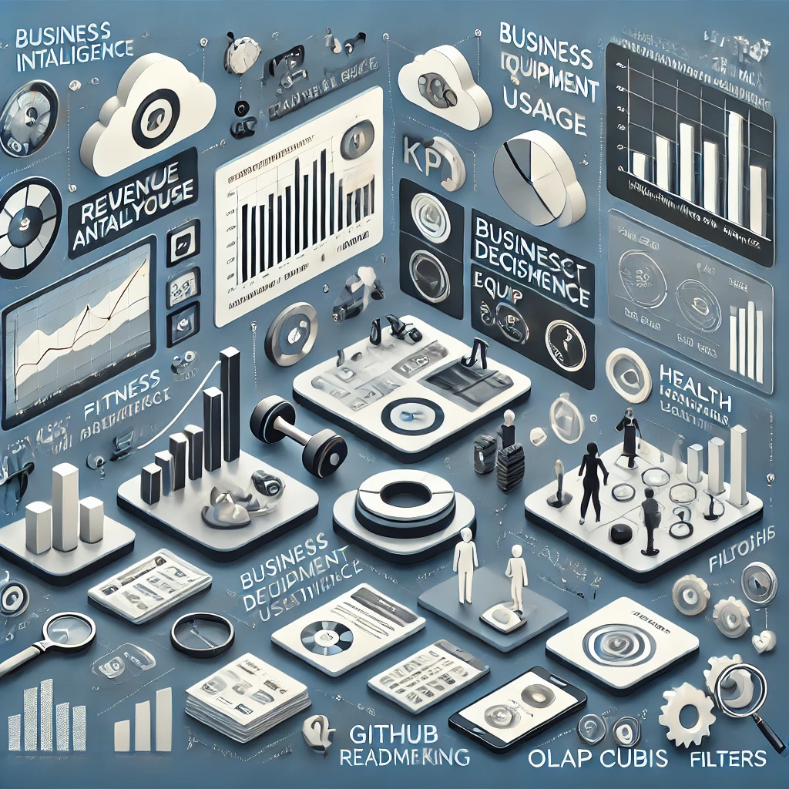

# Business Intelligence Dashboard – Fitness Center Analytics

## Overview
This project presents a Business Intelligence (BI) solution for a fitness center using Tableau dashboards. It aims to provide insights into equipment utilization, user health performance, and financial efficiency. The project uses data warehouse concepts and OLAP analysis to support strategic decision-making.

## Key Objectives
- Monitor equipment usage and revenue performance.
- Analyze member health metrics (pulse, BMI, height).
- Identify high-performing equipment and underutilized assets.
- Support tailored workout program planning based on member data.
- Enable drill-down OLAP analysis of exercise trends and financial KPIs.

## Technologies Used
- Tableau (Dashboards & Data Visualization)
- Data Warehouse (Star Schema Design)
- Excel / CSV for data integration

## Dashboard Reports
### 📊 Equipment Utilization & Revenue Report
- Revenue per Equipment (bar chart)
- Equipment Sales Frequency
- Cost per Equipment
- ROI Analysis per Supplier

### 💪 User Health Performance Report
- Pulse Variation by Day and User
- BMI Progression Across Time Periods
- Health Status & Height Metrics Visualization
- Filters by Day, Health Status, Height, and BMI

### 🔍 OLAP Repetitions Report
- Repetition Count per Exercise per Time Period
- Avg Payment to Equipment per Session
- Temporal Usage Patterns and Exercise Engagement

## Report Structure
- `HW2.twbx`: Tableau workbook containing all dashboard views
- `Report.pdf`: Project report detailing dashboard insights, business decisions, and recommendations

## Key Business Insights
- High-revenue equipment identified (e.g., Treadmill > Bench Press)
- Underutilized equipment requires inventory planning
- Member performance tracking supports customized workout planning
- OLAP cubes provide drill-down into engagement trends over time

## Setup Instructions
1. Open `HW2.twbx` in Tableau Desktop.
2. Use interactive filters and views to explore insights.
3. Refer to `Report.pdf` for documentation of analysis and findings.

---
This BI solution demonstrates how fitness centers can transform raw data into actionable insights using modern dashboarding tools and data warehouse design principles.

